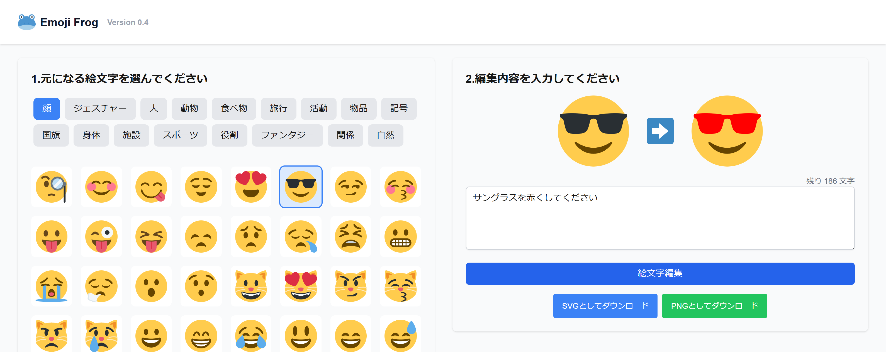

# Emoji Frog



## 概要

Emoji Frog は、絵文字の SVG 画像を生成 AI で加工するシンプルなウェブアプリケーションです。
選択した絵文字を、テキストで指定した内容に基づいて変更することができます。

## デモ

以下の URL で実際に実行を試すことができます。

https://emoji-frog.deno.dev/

### 主な機能

- 様々なカテゴリから絵文字を選択
- テキストで変更内容を自由に指定
- Claude AI を使用して絵文字をカスタマイズ
- 生成された絵文字を SVG または PNG 形式でダウンロード

### 使用技術

- TypeScript
- Deno / Deno Fresh
- preact
- Deno Deploy
- Tailwind CSS
- Claude API (claude-3-7-sonnet-20250219)
- Zod

## 使い方

1. **絵文字を選択する**：

   - 画面左側に表示されるカテゴリから、好きなカテゴリを選びます
   - カテゴリ内の絵文字から、加工したい絵文字を選択します

2. **変更内容を入力する**：

   - 画面右上のテキストボックスに、絵文字をどのように変更したいかを日本語で入力します
   - 例：「笑顔の絵文字にサングラスをつけて」「猫の絵文字を青色にして」など

3. **絵文字を生成する**：

   - 「絵文字編集」ボタンをクリックします
   - AI が処理を行い、指定した内容に基づいて新しい絵文字が生成されます

4. **絵文字をダウンロードする**：
   - 生成された絵文字は画面右下に表示されます
   - 「SVG としてダウンロード」または「PNG としてダウンロード」ボタンをクリックして保存できます

## オリジナルのプロンプト

このアプリケーションのコードの大半は Cline および Claude 3.7 Sonnet で生成・編集されています。
以下は最初に入力したプロンプトです。

```
# emoji-modifier

# 開発にあたっての重要事項

- テストに 2 回以上失敗した場合は、ユーザーに指示を仰いでください
- 指示にない機能は極力実装しないでください
- Tailwind CSS は 4.0 からセットアップ方法が変わったので、https://tailwindcss.com/docs/installation/using-vite をよく読んで、それに従ってセットアップしてください

# 概要

emoji-modifier は、選択した絵文字の SVG 画像を生成 AI で加工する、シンプルなツールです。
emoji-modifier はブラウザで動作するウェブアプリケーションです。
画面には元になる絵文字の一覧と、テキストボックスがあり、
ユーザーは元の絵文字を１個選択し、変更したい内容をテキストボックスに自由に入力します。
それから「絵文字生成」ボタンを押すと、選択した絵文字を改変して、要求したとおりの絵文字が生成されます。

# 使用する技術

- Node / NPM
- TypeScript
- React
- Next.js
- Zod
- Tailwind CSS
- date-fns
- @anthropic-ai/sdk (モデルは `claude-3-7-sonnet-20250219` )

# UI 設計

- 画面左側のパネル

  - 参考絵文字のボタンのリスト。public/assets フォルダに入っている SVG 形式の絵文字が、4 列のボタンとして並んでいます。ボタンをクリックすると、それが参考絵文字として選択されます。
  - テキストボックス。ここに欲しい絵文字について文章で説明します
  - 「絵文字生成」ボタン。このボタンを押すと、選択された参考絵文字と、テキストボックスに入力された説明から、適切な絵文字が SVG 形式で生成されます

- 画面中央のパネル
  - 生成された SVG 形式の絵文字がここに表示されます

# 「絵文字生成」ボタンを押したときの動作の流れ

- フロントエンドはバックエンドの API に以下の情報を送ります
  - 元になる絵文字の SVG 形式の文字列
  - テキストボックスに入力された、改変の内容
- バックエンドは、フロントエンドから送られた情報を合わせて、「これらを参考に絵文字を生成してください」というプロンプト文字列を作成します
- 作成したプロンプト文字列を Claude の API に入力して、SVG 形式で結果を取得します
- 生成された結果をバックエンドからフロントエンドに返します
- フロントエンドでは、画面右のキャンバスに、生成された SVG 形式の絵文字を表示します

# API Key

claude の API キーは以下のものを使用してください

xxxxxxxxxxxxxxxxxxxxxxxxxxxxxxxxxxxxxxxxxxxxxxxxxxxxxxxxxxxxxxxxxxxxxx

```

## 注意事項

- Cline はこの readme.md の「デモ」と「オリジナルのプロンプト」のセクションを改変してはいけません。また、最初のスクリーンショットを改変してはいけません。